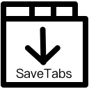

<p align="center">
    <a href="https://chrome.google.com/webstore/detail/savetabs/ikjiakenkeediiafhihmipcdafkkhdno"></a>
    <div align="center">
        <span style="font-size:16px;">SaveTabs</span> - <span style="font-size:14px;font-weight:300;">一个保存网页标签的插件</span>
    </div>
</p>
<div align="center">
    <div><a style="font-size:12px" href="../../README.md">[English README]</a></div>
    <div>
        <a href="https://github.com/hzh-cocong/SaveTabs/releases"></a>
        <a href="https://github.com/hzh-cocong/SaveTabs/blob/main/LICENSE"></a>
    </div>
</div>

---

## SaveTabs 是什么?

SaveTabs 读取网页标签地址并保存为 HTML 文件，当打开这些 HTML 文件时，它会重新打开之前保存的标签页面。

其保存和打开的是当前窗口的所有标签地址，就像 Workspace 一样。

其生成的文件如下示例：

```html
<!DOCTYPE>
<html>

<head>
    <meta http-equiv="Content-Type" content="text/html;charset=UTF-8" />
    <title>SaveTabs</title>
</head>

<body>
    <a href="https://github.com/hzh-cocong/SaveTabs">hzh-cocong/SaveTabs: Save brower tabs as a file so that you can
        open them again just like a workspace.</a><br />
    <a href="https://github.com/hzh-cocong/Chrome-Workspace">hzh-cocong/Chrome-Workspace: A alfred workflow for the
        chrome extension of savetabs</a><br />
    <a href="https://chrome.google.com/webstore/detail/savetabs/ikjiakenkeediiafhihmipcdafkkhdno?hl=zh-CN">SaveTabs -
        Chrome 网上应用店</a><br />
    <a href="https://www.extfans.com/productivity/ikjiakenkeediiafhihmipcdafkkhdno/">SaveTabs Chrome插件,SaveTabs
        谷歌浏览器插件下载_安装_教程-扩展迷</a><br />

    <script>
        var res = new Object();
        document.querySelectorAll('a').forEach(function (el) {
            var res2 = window.open(el.getAttribute('href'));
            if (res2 == null) {
                res = null;
            }
        })
        if (res != null) {
            window.close()
        };
    </script>
</body>

</html>
```

有一点要注意，该脚本文件需要你允许弹出窗口，因为它就是通过这种方式回复原来的标签的。

你也可以下载 Alfred 插件 [Chrome-Workspace](https://github.com/hzh-cocong/Chrome-Workspace)，它会自动新建新的浏览器窗口来执行 HTML 文件。


## 下载

[Chrome 应用商店](https://chrome.google.com/webstore/detail/savetabs/ikjiakenkeediiafhihmipcdafkkhdno)

[扩展迷](https://www.extfans.com/productivity/ikjiakenkeediiafhihmipcdafkkhdno/)

[CRX 文件](https://github.com/hzh-cocong/SaveTabs/releases/download/v1.0.0/ikjiakenkeediiafhihmipcdafkkhdno_main.crx)

